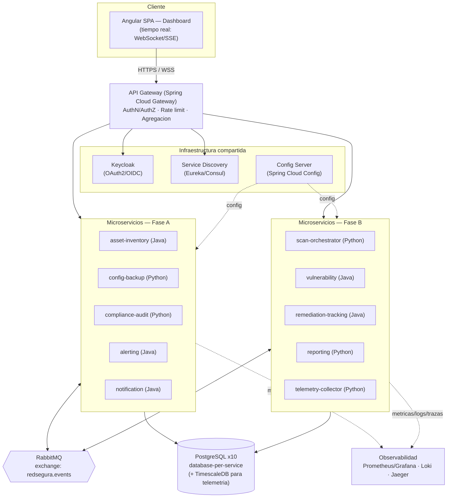
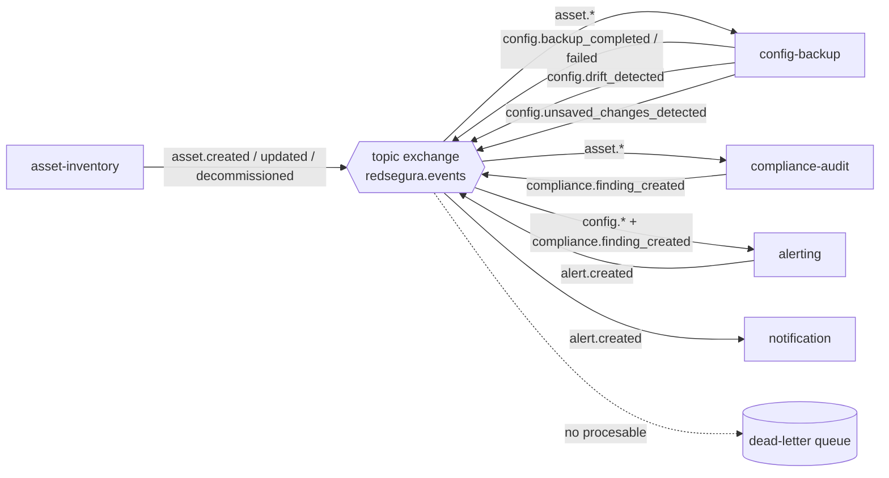
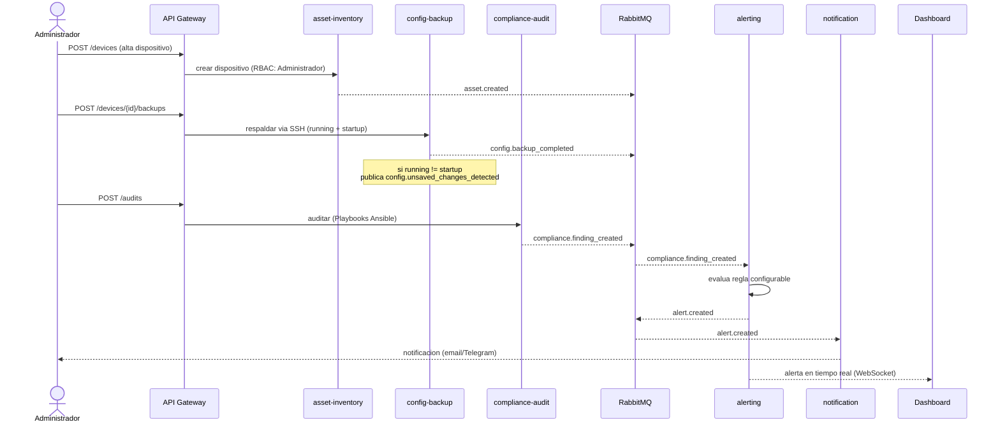
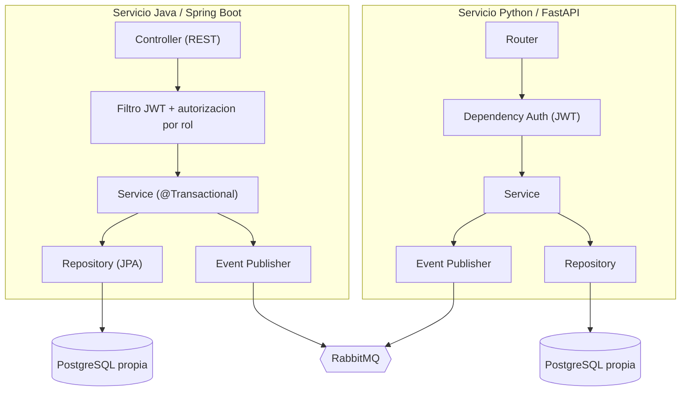
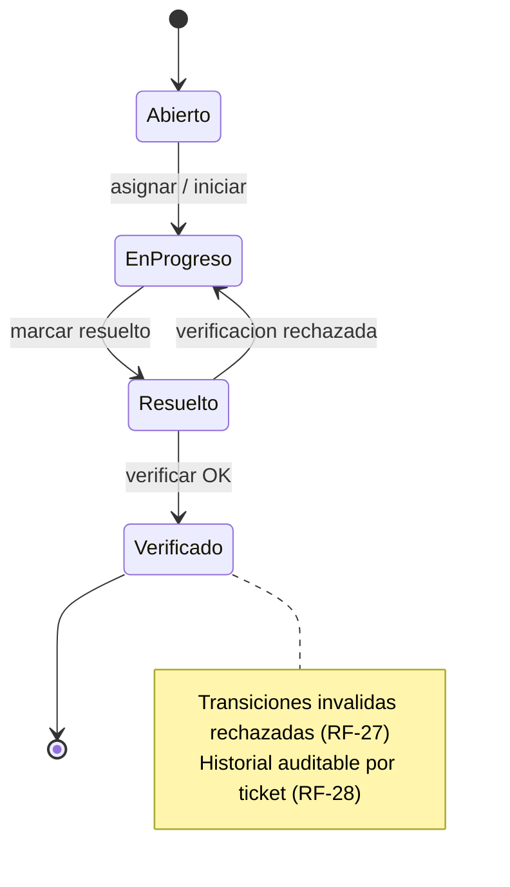
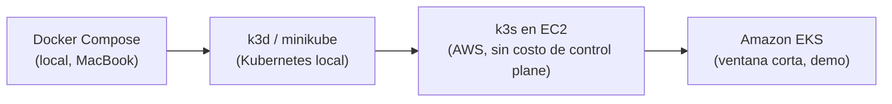

# Diagrama de arquitectura — redSegura

> Diagramas en [Mermaid](https://mermaid.js.org/) (se renderizan en GitHub/GitLab).
> Contexto y decisiones: [`memoria_tecnica_global.md`](memoria_tecnica_global.md).

**Última actualización:** 2026-07-11 · **Estado:** en desarrollo (Fundación)

---

## 1. Vista de capas / componentes

---

## 2. Flujo de eventos (RabbitMQ pub/sub — Fase A)

---

## 3. Flujo clave: golden path de Fase A

Alta de un dispositivo → respaldo → auditoría → alerta → notificación/dashboard.

---

## 4. Estructura interna de un microservicio (patrón por capa)

> Regla transversal: DTO ↔ entidad (nunca exponer entidades), excepciones tipadas de negocio,
> manejo global de errores sin filtrar internos, e inyección por constructor / DI nativa.

---

## 5. Máquina de estados: ticket de remediación (Fase B)

---

## 6. Vista de despliegue (evolución Docker Compose → Kubernetes)

> Mismo código en todos los entornos; solo cambia la configuración (12-factor, RNF-22).
> Infraestructura definida como código con Terraform (RNF-23); entorno AWS "apagado por
> defecto" por presupuesto (RNF-24).
