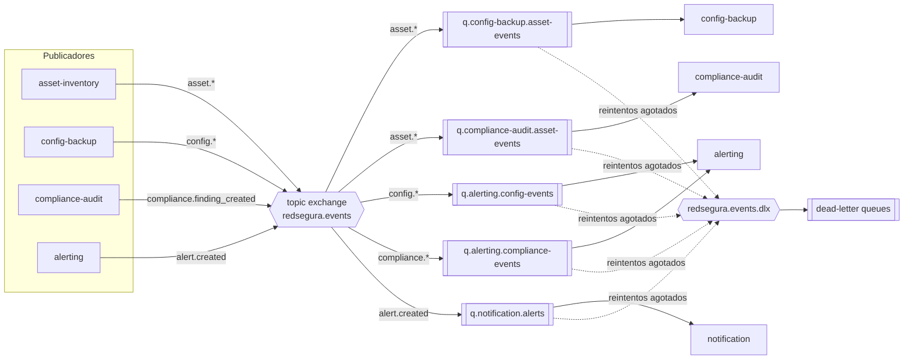

# Especificación técnica — Comunicación por eventos (RabbitMQ)

> Especificación transversal del mecanismo de mensajería asíncrona de redSegura: topología,
> convenciones, garantías de entrega y **esquema de cada evento**. Es el contrato autoritativo
> de eventos referenciado por la memoria técnica global (§4.3) y por el `CLAUDE.md`.

**Estado:** borrador · **Autor:** David Reyna Pineda · **Fecha:** 2026-07-11

---

## 1. Objetivo y contexto

- **Qué resuelve:** define cómo los microservicios se comunican de forma **asíncrona y
  desacoplada** mediante eventos de dominio, evitando cadenas frágiles de llamadas síncronas
  directas entre servicios.
- **Por qué ahora:** el catálogo de eventos es un **contrato compartido**; debe acordarse antes
  de codificar cualquier productor o consumidor (regla contract-first del proyecto).
- **No-objetivos:** no cubre comunicación síncrona (REST vía API Gateway, ver OpenAPI de cada
  servicio) ni los eventos de Fase B (salvo `vulnerability.critical_found`, incluido como
  referencia porque `alerting` lo consumirá).

---

## 2. Requisitos

**Funcionales**
- RF-E1: cada servicio publica sus eventos de dominio al broker ante cada cambio relevante
  (RF-05, RF-09, RF-14, RF-24, RF-30).
- RF-E2: los consumidores reaccionan a los eventos sin acoplamiento directo con el productor.
- RF-E3: todo evento no procesable tras los reintentos se deriva a una *dead-letter queue* (DLQ)
  para inspección, sin bloquear la cola principal.

**No funcionales**
- RNF-E1: **entrega al-menos-una-vez** (at-least-once); los consumidores son **idempotentes**
  (deduplican por `eventId`).
- RNF-E2: mensajes y colas **durables/persistentes** (sobreviven reinicio del broker).
- RNF-E3: **reintentos con backoff** ante fallo del consumidor; tope de intentos → DLQ.
- RNF-E4: consistencia productor↔evento mediante **transactional outbox** (no publicar si la
  transacción de BD no confirmó — evita el problema de doble escritura).
- RNF-E5: sin PII ni secretos en el `payload` de los eventos (RNF-17).
- RNF-E6: **versionado** de esquema por evento (SemVer); cambios aditivos compatibles.

---

## 3. Diseño propuesto

### 3.1 Topología
- **Un `topic exchange`:** `redsegura.events` (durable).
- **Routing keys:** `dominio.evento` (p. ej. `config.drift_detected`). Los consumidores se
  suscriben con patrones (`asset.*`, `config.*`).
- **Una cola por (servicio consumidor × interés):** nombre `q.<servicio>.<interes>`.
- **Dead-lettering:** un exchange `redsegura.events.dlx` y una DLQ por cada cola principal
  (`<cola>.dlq`). Reintentos con backoff vía cola de reintento con TTL antes de la DLQ.



### 3.2 Bindings (Fase A)

| Cola | Binding (routing key) | Servicio consumidor |
|---|---|---|
| `q.config-backup.asset-events` | `asset.*` | config-backup |
| `q.compliance-audit.asset-events` | `asset.*` | compliance-audit |
| `q.alerting.config-events` | `config.*` | alerting |
| `q.alerting.compliance-events` | `compliance.finding_created` | alerting |
| `q.notification.alerts` | `alert.created` | notification |

### 3.3 Sobre (envelope) común a todos los eventos
Todos los eventos comparten esta estructura; lo específico va en `payload`.

```json
{
  "eventId": "3f1c…-uuid",          // idempotencia: único por evento
  "eventType": "config.drift_detected",
  "version": "1.0.0",                // SemVer del esquema del evento
  "occurredAt": "2026-07-11T18:30:00Z", // ISO-8601 UTC
  "traceId": "b7d9…",               // correlación distribuida (RNF-16)
  "source": "config-backup-service",
  "payload": { }
}
```

| Campo | Tipo | Regla |
|---|---|---|
| `eventId` | UUID | único; los consumidores deduplican por él |
| `eventType` | string | igual a la routing key |
| `version` | string (SemVer) | cambios aditivos → `minor`; ruptura → `major` o nuevo `eventType` |
| `occurredAt` | string (ISO-8601 UTC) | momento del hecho, no de la publicación |
| `traceId` | string | propagado desde la solicitud origen |
| `source` | string | servicio productor |
| `payload` | objeto | específico del evento (§4) |

---

## 4. Catálogo de eventos y esquema de `payload` (Fase A)

### 4.1 `asset.created` · `asset.updated` · `asset.decommissioned` — publica `asset-inventory`
```json
{
  "deviceId": "uuid",
  "hostname": "SW1-CORE",
  "managementIpv4": { "address": "10.0.0.11", "prefixLength": 24, "gateway": "10.0.0.1" },
  "managementIpv6": { "address": "2001:db8:acad:1::11", "prefixLength": 64, "gateway": "2001:db8:acad:1::1" },
  "vendor": "Cisco",
  "model": "Catalyst 9300",
  "location": "Rack A / VLAN 10",
  "criticality": "ALTA",          // ALTA | MEDIA | BAJA
  "status": "ACTIVO"              // ACTIVO | BAJA
}
```
- **Direccionamiento dual-stack (RF-05a):** el dispositivo lleva **al menos una** de
  `managementIpv4` / `managementIpv6` (la que no aplique se omite). El `payload` transporta la
  dirección **en claro** (los consumidores internos la necesitan; la redacción por rol es solo de la
  API HTTP). Cambio de contrato aditivo → `version` del evento sube a `minor` (1.1.0).
- `asset.updated` incluye además `changedFields: ["criticality", "managementIpv6", ...]`.
- `asset.decommissioned` puede llevar solo `deviceId`, `hostname`, `status: "BAJA"`.
- **Consumidores:** config-backup y compliance-audit (para mantener su vista de dispositivos).

### 4.2 `config.backup_completed` — publica `config-backup`
```json
{
  "deviceId": "uuid",
  "backupId": "uuid",
  "commit": "a1b2c3d",           // commit del repo Git interno (ADR-01)
  "capturedAt": "2026-07-11T18:00:00Z",
  "unsavedChanges": false,        // running != startup (ADR-02)
  "status": "SUCCESS"
}
```

### 4.3 `config.backup_failed` — publica `config-backup`
```json
{ "deviceId": "uuid", "attemptedAt": "2026-07-11T18:00:00Z", "reason": "SSH timeout" }
```

### 4.4 `config.drift_detected` — publica `config-backup` (RF-09)
```json
{
  "deviceId": "uuid",
  "baselineBackupId": "uuid",     // ultimo respaldo contra el que se comparo
  "driftRef": "diff:running@live-vs-a1b2c3d",
  "detectedBy": "drift-check",     // backup | drift-check
  "detectedAt": "2026-07-11T18:05:00Z"
}
```

### 4.5 `config.unsaved_changes_detected` — publica `config-backup` (ADR-02)
```json
{
  "deviceId": "uuid",
  "backupId": "uuid",
  "runningVsStartupDiffRef": "diff:running-vs-startup@a1b2c3d",
  "detectedAt": "2026-07-11T18:00:00Z"
}
```

### 4.6 `compliance.finding_created` — publica `compliance-audit` (RF-14)
```json
{
  "findingId": "uuid",
  "deviceId": "uuid",
  "auditId": "uuid",
  "policy": "SSH_V2_REQUIRED",
  "severity": "ALTA",             // CRITICA | ALTA | MEDIA | BAJA
  "evidence": "transport input telnet enabled on vty 0 4",
  "createdAt": "2026-07-11T18:10:00Z"
}
```

### 4.7 `alert.created` — publica `alerting` (RF-30)
```json
{
  "alertId": "uuid",
  "severity": "ALTA",
  "deviceId": "uuid",
  "sourceEvent": "compliance.finding_created", // evento que la disparo
  "ruleId": "uuid",                            // regla configurable que la genero
  "detail": "Politica SSH_V2_REQUIRED incumplida en SW1-CORE",
  "createdAt": "2026-07-11T18:11:00Z"
}
```
- **Consumidor:** notification (envía email/Telegram según severidad; ADR-03).

### 4.8 `vulnerability.critical_found` — publica `vulnerability` *(Fase B, referencia)*
```json
{ "deviceId": "uuid", "findingId": "uuid", "cveId": "CVE-2025-12345", "cvssScore": 9.8 }
```

---

## 5. Alternativas consideradas

| Alternativa | Pros | Contras | ¿Elegida? |
|---|---|---|---|
| **RabbitMQ (topic exchange)** | Enrutamiento flexible, DLQ nativo, ligero, autoalojable | Menor throughput que Kafka | ✓ |
| Apache Kafka / MSK | Alto throughput, retención/replay | Costoso a esta escala; sobredimensionado | ✗ |
| Llamadas REST síncronas entre servicios | Simple de razonar | Acoplamiento y cadenas frágiles; contra el principio event-driven | ✗ |
| Publicar sin outbox (dual write) | Menos piezas | Riesgo de inconsistencia BD↔broker | ✗ |

---

## 6. Impacto y riesgos

- **Blast radius: GLOBAL.** El catálogo de eventos es un contrato compartido: un cambio
  incompatible obliga a re-probar **todos** los consumidores del evento afectado (verificado con
  Pact). Cambios aditivos (`minor`) son compatibles hacia atrás.
- **Riesgos y mitigaciones:**
  - *Doble escritura BD/broker* → **transactional outbox** (RNF-E4).
  - *Procesamiento duplicado* (at-least-once) → **idempotencia** por `eventId` (RNF-E1).
  - *Envenenamiento de cola* (mensaje siempre falla) → reintentos con tope + **DLQ** (RNF-E3).
  - *Fuga de datos sensibles* → prohibido PII/secretos en `payload` (RNF-E5).

---

## 7. Plan de pruebas (resumen)

- **Contract testing (Pact) de mensajes:** el productor verifica que emite el esquema que el
  consumidor espera; el consumidor verifica que procesa el esquema publicado.
- **Integración con Testcontainers (RabbitMQ real):** publicar → consumir → idempotencia →
  reintento → DLQ.
- **Criterio de aceptación:** para cada evento de Fase A, productor y consumidor pasan su
  contrato Pact y el flujo publicar→consumir es idempotente y termina en DLQ tras N fallos.

---

## 8. Plan de implementación

- [~] Declarar exchange, colas, bindings y DLX/DLQ de forma idempotente al arranque de cada servicio.
  *(Productor `asset-inventory`: declara el exchange `redsegura.events` durable. Colas/bindings/DLQ
  los declaran los consumidores — pendientes.)*
- [x] Implementar el sobre común y la (de)serialización con `eventId`/`version`/`traceId`.
  *(Implementado en `asset-inventory` — `OutboxWriter`.)*
- [~] Implementar transactional outbox en cada productor. *(Hecho en `asset-inventory` (V3 +
  `OutboxWriter`/`OutboxRelay`); pendiente: publisher confirms y el resto de productores.)*
- [ ] Implementar consumidores idempotentes con reintento+backoff y DLQ.
- [ ] Contratos Pact por par productor/consumidor; gate en verde.

---

## 9. Preguntas abiertas

- ¿La regla por defecto de `config.unsaved_changes_detected` en `alerting` debe exigir
  persistencia en 2 respaldos consecutivos antes de alertar? (mitigación de fatiga de alertas).
- El patrón **transactional outbox** quedó registrado como **ADR-04** en la memoria técnica
  global (§2).
