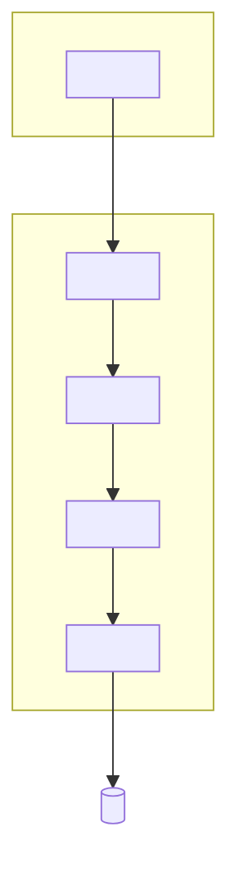
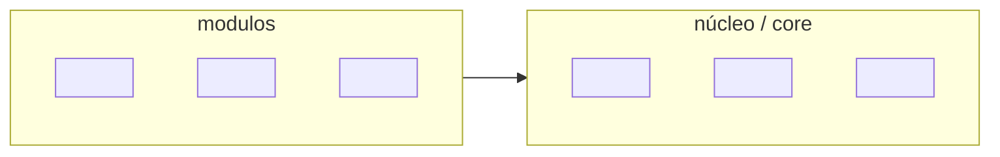
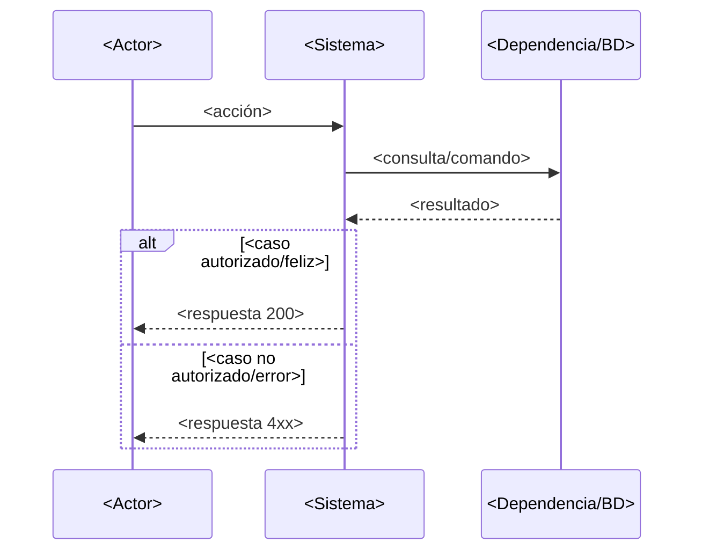
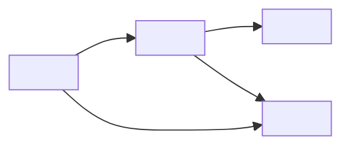

# Diagrama de arquitectura — <NOMBRE DEL PROYECTO>

<!-- GUÍA: usa Mermaid (se renderiza en GitHub/GitLab; no requiere imágenes). Mantén 3-5 diagramas
     máximo: capas, estructura interna, un flujo clave y (si aplica) máquinas de estado.
     Borra los que no apliquen a tu tipo de proyecto. -->

> Diagramas en [Mermaid](https://mermaid.js.org/).

## Vista de capas / componentes

## Estructura interna de módulos

## Flujo clave: <p.ej. autenticación / petición principal / pipeline>

## Máquina(s) de estado [opcional, si hay entidades con ciclo de vida]

