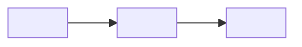

# Especificación técnica — <FUNCIONALIDAD / COMPONENTE>

<!-- GUÍA: úsala para detallar una funcionalidad/componente ANTES de construirlo, cuando la propuesta
     de módulo no basta (algo complejo, transversal o con riesgo). Es el "qué" y el "cómo" preciso.
     Si la funcionalidad es simple, una propuesta de módulo es suficiente: no sobre-documentes. -->

**Estado:** <borrador | aprobada | implementada> · **Autor:** <...> · **Fecha:** <YYYY-MM-DD>

## 1. Objetivo y contexto

- **Qué resuelve:** <...>
- **Por qué ahora:** <...>
- **No-objetivos (out of scope):** <...>

## 2. Requisitos

**Funcionales**
- RF1: <el sistema debe ...>
- RF2: <...>

**No funcionales** (rendimiento, seguridad, disponibilidad, accesibilidad)
- RNF1: <p.ej. responde < 300 ms p95>
- RNF2: <...>

## 3. Diseño propuesto

- **Enfoque:** <descripción de la solución>.
- **Componentes nuevos/afectados:** <...>.
- **Diagrama:** [opcional, Mermaid inline o enlace].
- **Modelo de datos / contratos:** <esquemas, DTOs, firmas — nombres EXACTOS>.

## 4. Alternativas consideradas

| Alternativa | Pros | Contras | ¿Elegida? |
|---|---|---|---|
| <A> | <...> | <...> | ✓/✗ |
| <B> | <...> | <...> | ✓/✗ |

## 5. Impacto y riesgos

- **Blast radius:** <local | global> — qué se debe re-probar.
- **Compatibilidad / migraciones:** <...>.
- **Riesgos y mitigaciones:** <riesgo → mitigación>.

## 6. Plan de pruebas (resumen)

- Casos clave por categoría (detalle en `docs/qa/casos_de_prueba_modulo_<nombre>.md`): <SEC, VAL, FLOW, ...>.
- Criterio de aceptación: <medible>.

## 7. Plan de implementación

- [ ] <paso 1>
- [ ] <paso 2>
- [ ] Gatekeeper en verde + documentación actualizada.

## 8. Preguntas abiertas

- <pregunta pendiente de resolver antes de implementar>
