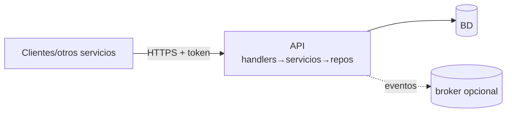

# Ejemplo resuelto — API / microservicio (sin UI propia)

<!-- GUÍA: cómo adaptar las plantillas para un servicio backend puro (API REST/gRPC, microservicio). -->

## Perfil del proyecto
- **Tipo:** servicio/API consumido por otros sistemas (no tiene interfaz de usuario).
- **Stack de ejemplo:** FastAPI/Spring Boot/Express · PostgreSQL/Mongo · OpenAPI · OAuth2/JWT/API key.

## CLAUDE.md → comandos del gatekeeper
```
1) <build/compile o validación OpenAPI>   2) pytest / mvn test / npm test   3) ruff+mypy / lint
Contratos: validar el spec OpenAPI/proto en CI (breaking-change check).
```

## Aplicabilidad de categorías de prueba
- **N/A:** UI, VIS (no hay interfaz).
- **Énfasis fuerte:** SEC/RBAC (authz por endpoint), RN (reglas y códigos), ERR (forma de error consistente),
  CYBER (inyección, authz server-side, rate limiting), VAL (validación de payloads), FLOW (idempotencia/estados).
- **Contract testing** como categoría extra: el response respeta el esquema publicado.

## Arquitectura (diagrama)


## Contratos (memoria §4) — lo crítico
- Versionado de API (`/v1`); política de compatibilidad hacia atrás.
- Esquema de error uniforme: `{ code, message, details }`; nunca filtrar stack traces/tipos internos.
- Paginación, filtros e idempotencia (claves de idempotencia en operaciones de escritura).

## Pruebas de seguridad server-side (CYBER)
```bash
# enforcement por rol / scope
curl -H "Authorization: Bearer <token_rol_sin_permiso>" https://api/.../recurso   # espera 403
curl https://api/.../recurso                                                       # sin token → 401
# parámetro malformado → 400 (sin filtrar tipos internos)
```

## Despliegue
- Contenedor sin estado, escalable horizontalmente; health/readiness endpoints.
- Migraciones versionadas; secretos vía gestor/variables; observabilidad (logs estructurados + métricas).

## Pitfalls reales (lecciones)
- Endpoint de colección que devuelve `[]` donde el cliente espera objeto paginado (o viceversa).
- 500 por excepción no mapeada en vez de 400/422 con mensaje útil.
- Falta de rate limiting en autenticación desde el primer commit.
