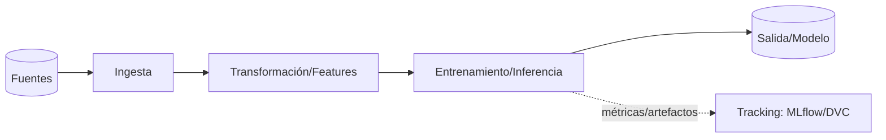

# Ejemplo resuelto — Proyecto de datos / IA (Python)

<!-- GUÍA: cómo adaptar las plantillas para pipelines de datos, ML o servicios de IA en Python.
     Aquí "módulo" suele ser una etapa del pipeline o un experimento/modelo. -->

## Perfil del proyecto
- **Tipo:** pipeline de datos / entrenamiento+inferencia de modelos / servicio de IA.
- **Stack de ejemplo:** Python 3.12 · uv/pip · pandas/Polars · scikit-learn/PyTorch · FastAPI (si sirve modelo) ·
  pytest · ruff+mypy · MLflow/DVC (tracking opcional).

## CLAUDE.md → comandos del gatekeeper
```
1) ruff check . && mypy .        (lint + tipos)
2) pytest -q                     (unit + tests de datos)
3) <validación de datos: great_expectations / pandera>   y, si hay modelo, umbral de métrica mínima
Reproducibilidad: semilla fija; entorno bloqueado (uv.lock/requirements.txt).
```

## Aplicabilidad de categorías de prueba (reinterpretadas)
- **N/A:** UI, VIS, RBAC (salvo que exponga un servicio).
- **VAL → validación de datos:** esquema, rangos, nulos, tipos, duplicados (pandera/Great Expectations).
- **RN → reglas del dominio/negocio** en las transformaciones.
- **FLOW → orquestación** del pipeline (orden de etapas, reintentos, idempotencia).
- **Categorías extra propias:**
  - **DATA-QUALITY:** integridad/consistencia de entradas y salidas.
  - **MODEL:** métricas mínimas (accuracy/F1/RMSE), ausencia de fuga de datos (leakage), estabilidad.
  - **DRIFT:** detección de cambio en distribución entrada/salida.
  - **REPRO:** misma entrada + semilla → misma salida.

## Arquitectura (diagrama)


## Memoria técnica — secciones que más rinden aquí
- §4 Contratos: esquema de datos de entrada/salida (columnas, tipos, unidades) EXACTOS.
- §5 Algoritmos: features, pre/post-proceso, criterios de corte; decisiones de modelado.
- §7 Evidencia: comando + métricas reales (no "el modelo funciona"): `pytest` + tabla de métricas por dataset.

## Despliegue / operación
- Servir el modelo como API (ver ejemplo_api_servicio) o ejecutar el pipeline como job programado.
- Versionar datos y modelos (DVC/registro de modelos); registrar versión de datos→modelo→código.
- Monitoreo de **drift** y de métricas en producción; plan de reentrenamiento/rollback de modelo.

## Pitfalls reales (lecciones)
- Fuga de datos (leakage) entre train/test → métricas infladas que no se sostienen en producción.
- No fijar semilla/entorno → resultados no reproducibles.
- Validar el modelo pero no los **datos de entrada** → "garbage in, garbage out" silencioso.
- Notebooks como única fuente de verdad → mover la lógica a módulos testeables.
