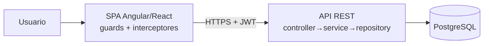

# Ejemplo resuelto — Proyecto full-stack web (SPA + API REST + BD + RBAC)

<!-- GUÍA: muestra cómo se rellenan los placeholders de las plantillas para este tipo de proyecto.
     Copia los fragmentos que apliquen a tu proyecto real. Stack de ejemplo intercambiable. -->

## Perfil del proyecto
- **Tipo:** web full-stack, multi-repo (frontend + backend).
- **Stack de ejemplo:** Angular/React (SPA) · Spring Boot/Node (API REST) · PostgreSQL · JWT + RBAC.

## CLAUDE.md → comandos del gatekeeper
```
Frontend:  1) ng build --configuration=production  2) ng test --no-watch  3) eslint .
Backend:   1) mvn -q compile   2) mvn test   3) checkstyle/spotless
```
> Nota real: el runner de tests puede NO aplicar el type-check estricto de plantillas → el build NO es opcional.

## Aplicabilidad de categorías de prueba
Todas aplican. Énfasis en **UI/VIS** (hay interfaz), **RBAC** (rutas+UI+datos), **SEC** (acceso por URL directa),
**CYBER** (redacción server-side, verificada con `curl` + JWT por rol).

## Arquitectura (diagrama)


## Decisiones típicas a registrar (memoria global §2)
- Estado en cliente con servicios + observables (sin store global) por escala media.
- Paginación estándar `PageResponse<T>`; búsqueda accent-insensitive (`unaccent`).
- RBAC en 3 niveles: ruta (guard), UI (visibilidad), datos (redacción server-side).

## Despliegue
- Frontend: build estático servido por CDN/nginx. Backend: contenedor + reverse proxy + TLS.
- Smoke test: login, una ruta por módulo, health check del API.

## Pitfalls reales (añádelos a tu registro de lecciones)
- Asumir nombres de campos del DTO sin verificar el contrato → dropdown vacío silencioso.
- Ocultar dato sensible con CSS pero dejarlo en el DOM/respuesta.
- Botón guardar habilitado sin cambios (falta estado "dirty").
- Click en fila clicable que burbujea y destruye el componente antes de `afterClosed()`.
